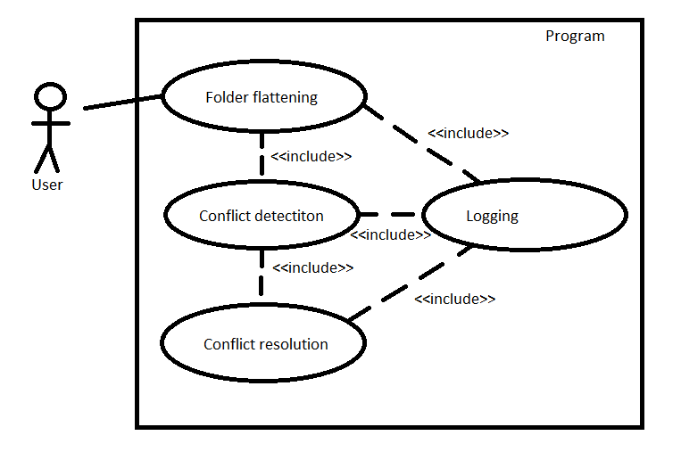

# Software engineering final project

## Description

The goal of the project is to create an application with a grapphical user interface for flattening nested directories with files. The user from the GUI can choose the source directory and the destination folder, where all the files from the nested source directory will be copied, the flattening operation has to be reversible. After each operation, a log file will be created in which the history of the performed operations on files will be stored. In case of a conflict during copying files to the target folder (i.e. copied files have the same name), the user will be informed about it and will have to decide on his own about the occurred conflict (giving a new name to one of the files or skipping the copying of the file causing the conflict). The minimum requirement is that the application works with the Windows platform and that it works on desktop devices.


## Project's requierements

This section contains functional and non-functional requirements of the project.

### Functional requierements

- Application has to have a GUI.

- Minimal requirement is a Windows application. Widnows and Linux compatibility is preferred.

- Program should allow user to resolve problems that may occur during execution.

- Program should log it's operations.

- Operation of flattening should be reversible.


### Non-functional requierements

- Application should display the information about conflicts between names of the files.

- User input should be tokenized.

- Conflict resolution dialog should allow user to specify a new name of the file, skip or replace it.


## Project's dictionary

> **Algorithm** - Flattening algorithm implemented in the program.

> **Conflict** - In terms of flattening, the situation when two files are assigned with the same names.

> **Conflict resolution** - Operation of resolving the conflict.

> **Destination directory** - The directory to which files from the flattend directory will be saved.

> **Input directory** - The directory that user specified to be flattend.

> **Subfolder** - Folder located inside Input/Destination directory hierarchy. Can contain other subfolders.


## Use case model

### Actors

> **User** - The regular user of the program. User wants to perform the operation of folder flattening. User is expected to have basic knowledge about program and file system. It is assumed that user has proper access levels to folders on which program will execute.

### Use case

The program is expected to move all files from one folder hierarchy to another. Files in destination directory should have names that will allow to identify them. After operation of flattening the log file can be found inside destination directory. Log file contains all of the informations about the files that were copied to destination directory. Example of the line from the log file looks like this:

```
source_dir/subdir/file1.txt -> destination_dir/tokenized_name_of_file1.txt
```

In case of conflict program displays the proper message and allows to ammend the problem. Such situation produces record in log file:

```
[!] Conflict source_dir/dir2/file1.txt -> destination_dir/name_of_file1.txt
[+] source_dir/subdir2/file1.txt -> destination_dir/name_of_file1_copy.txt
```



- "<<extends>>" has to be added
- Use case model has to be consitent with Project's dictionary
- The direction of "<<include>>" has to be added
  
## Technology stack

*To be discussed...*
*One option is to go with C# and .Net framework.*
*Second is the C++ supported by Qt.*
