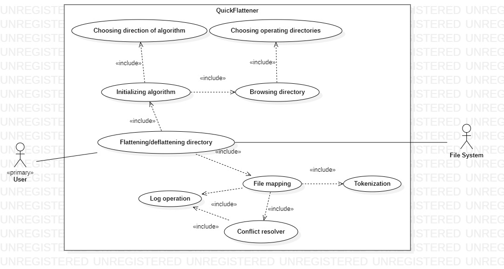

# Software engineering final project

## Overview

- Project name: QuickFlattener
- Authors: Adam Gembala, Robert Lotawiec
- Degree course: Informatics, sem V
- Academic year: 2021/2022


## Description

The goal of the project is to create an application with a graphical user interface for flattening nested directories with files. The user from the GUI can choose the source directory and the destination folder, where all the files from the nested source directory will be copied, the flattening operation has to be reversible. After each operation, a log file will be created in which the history of the performed operations on files will be stored. In case of a conflict during copying files to the target folder (i.e. copied files have the same name), the user will be informed about it and will have to decide on his own about the occurred conflict (giving a new name to one of the files or skipping the copying of the file causing the conflict). The minimum requirement is that the application works with the Windows platform and that it works on desktop devices.


## Project's requirements

This section contains functional and non-functional requirements of the project.

### Functional requirements

- User should be able to interact with the program through a graphical user interface.

- User privileges should be checked at runtime and program should not stop its execution when user lacks the read or write privilege on some file or nested directory. In such case program should omit it and log such accident in log file.

- Minimal requirement is a Windows application. Windows and Linux compatibility is preferred.

- Program should allow user to resolve conflicts that may occur during execution of the algorithm. Conflict should stop algorithm until user will choose conflict resolution option in modal dialog.

- Program should log which file was mapped onto which name. Log file should also contain information about conflicts and the way they were resolved. Program should also log other accidents such as lacking privileges or the files that could not be opened (i.e. when file was opened in other application). Log file should have an extension '*.flattening.log'.

- Operation of flattening is reversible through the GUI after providing the destination directory. Program should scan the directory if it's only one level deep and should itself find the log file by extension. In case of multiple log files user should be allowed to pick one and in case of nested directories program should prompt the warning but should allow to ignore them. 

- During execution of reverse operation if program is not able to find a file that was specified in log, it should display the information about missing file, but should not stop the operation.


### Non-functional requirements

- Application should display the information about conflicts between names of the files. 

- User input should be tokenized.

- Conflict resolution dialog should allow user to specify a new name of the file, skip or replace it.

- The user must have permissions to the directory and its files in order to perform the flattening process. If the user does not have such rights, the program should display an appropriate message and ask the user if he wants to continue the process only for folders and files to which he has rights in the source path.

- The files are copied to the new location and are removed from the old location along with any nested folders.

- The processing of each request should be done immediately.

- In order to undo the flattening process the user presses the reverse button, whereupon the program asks from the log file of which operation it should read the data of the flattening operation performed and perform the action of restoring the nested path.


## Project's dictionary

> **Algorithm** - Flattening algorithm implemented in the program.

> **Conflict** - In terms of flattening, the situation when two files are assigned with the same names.

> **Conflict resolution** - Operation of resolving the conflict in file naming. Possible ways to resolve a conflict are skipping a file or rename it.

> **Destination directory** - The directory to which files from the flattened directory will be saved.

> **Input directory** - The directory that user specified to be flattened.

> **Flattening process** - Flattening a directory means moving all the files from their various folder and/or subfolders into one parent folder in destination directory. 

> **Log file** - log file is a file that records events that occur after user's request for flattening process.

> **Nested Directory** - A folder stored within another folder. A nested folder is also named subfolder.

> **Notification** - Informing the user about conflict during program execution.

> **Search** - A process of searching the input directory to find all files to be flattened into one folder and moved to the destination directory.

> **Subfolder** - Folder located inside Input/Destination directory hierarchy. Can contain other subfolders.

> **User** - Person using the system for his or her own knowledge purposes.

> **Reverse operation** - operation of reverting the algorithm execution.


## Use case model

### Actors

> **User** - The regular user of the program. User wants to perform the operation of folder flattening. User is expected to have basic knowledge about program and file system. It is assumed that user has proper access levels to folders on which program will execute.

> **Logger** - Service that performs write operation to '*.flattening.log' file. It logs all events that may occur during program execution. 

> **File mapper** - Service that performs file mapping, detects conflicts and applies tokenization of user input.

> **File system** - File system on which program operates.

### Use case

The program is expected to move all files from one folder hierarchy to another. Files in destination directory should have names that will allow to identify them. After operation of flattening the log file can be found inside destination directory. Log file contains all of the information about the files that were copied to destination directory. Example of the line from the log file looks like this:

```
source_dir/subdir/file1.txt -> destination_dir/tokenized_name_of_file1.txt
```

In case of conflict program displays the proper message and allows to amend the problem. Such situation produces record in log file:

```
[!] Conflict source_dir/dir2/file1.txt -> destination_dir/name_of_file1.txt
[+] source_dir/subdir2/file1.txt -> destination_dir/name_of_file1_copy.txt
```


  
## Technology stack

*To be discussed...*
*One option is to go with C# and .Net framework.*
*Second is the C++ supported by Qt.*
